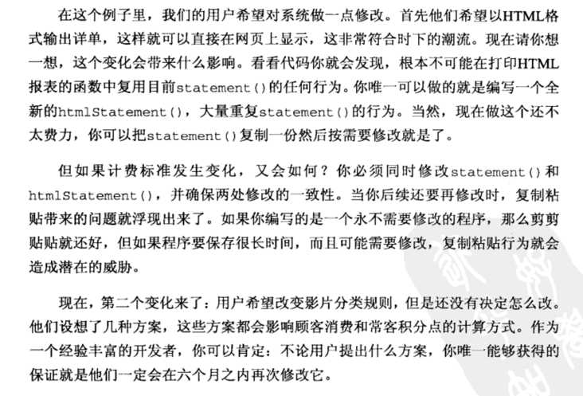

# 需求
影片出租程序：计算每一位顾客的消费金额并打印详单
- 操作者告诉程序顾客租了那些影片、租期多长，程序根据租凭时间和影片类型计算费用
  - 类型：普通、儿童、新片
- 除了计算费用还需要为常客计算积分，积分会根据租片种类是否为新片有所不同

# 程序问题
1. version1：
   - Customer里的statement方法做的事情太多了，它做了很多原本应该由其他类完成的事情

2. version2:每段代码做尽量少的事
3. version3运用多态取代与加个相关的条件逻辑